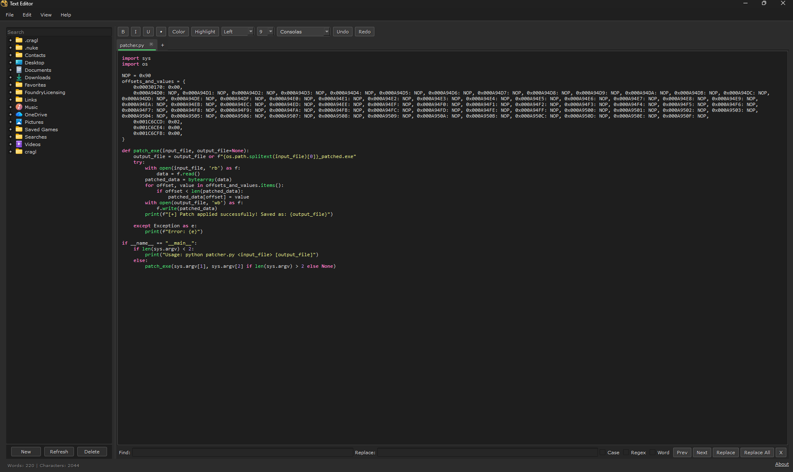

# Text Editor for Nuke

A lightweight and practical text editor panel for Nuke.  
Designed to provide a simple, reliable workspace for writing notes, editing text files, reviewing shot documentation, and organizing information directly inside Nuke without leaving the application.

This tool was created to solve a common workflow gap: having a clear, accessible place to write and manage notes while working on shots, whether locally or remotely.




---

## Features

- **Integrated File Browser**  
  Navigate folders, open text files, create new folders, delete items, and filter results with a built‑in search.

- **Multi‑Tab Editing**  
  Open multiple documents at once, duplicate tabs, rename tabs, or create new tabs using the inline “+” button.

- **Syntax Highlighting**  
  Safe, lightweight, regex‑based highlighting for a variety of common file types:
  Python, JSON, Markdown, Nuke `.nk`, HTML/XML, CSS, JavaScript, Bash, Batch, C/C++/Java, and more.

- **Find & Replace Panel**  
  Docked, persistent panel with:
  - case‑sensitive search  
  - regex mode  
  - whole‑word search  
  - replace one / replace all  
  - navigation through results  

- **Word & Bracket Highlighting**  
  Automatically highlights repeated words under the cursor and matching bracket pairs.

- **Autosave**  
  Silent autosave using idle‑based and interval‑based triggers.

- **Formatting Tools**  
  Bold, italic, underline, bullets, alignment, text color, highlight color, font size, and font family.

- **Status Bar**  
  Live word and character count.

- **About Panel**  
  Displays basic tool information and project links.

---

## Installation

1. Download the following files:

```
TextEditor.py
FileBrowser.py
menu.py
```

2. Place them into your Nuke plugin directory, for example:

```
~/.nuke/
```

3. Add the following line inside your `menu.py` file:

```python
import TextEditor
nuke.menu('Nuke').addCommand('Text Editor', 'TextEditor.show_texteditor()')
```

4. Restart Nuke.

You will now find the editor in:
```
Text Editor
```
under the main Nuke menu.

---

## Supported Platforms

- Nuke 11+  
- Compatible with both **PySide2** and **PySide6**
- Windows, macOS, and Linux

---

## Customization

Many parts of the tool can be customized:

- default fonts and font sizes  
- syntax color definitions  
- autosave timing  
- tab colors and behaviors  
- file browser root directory  
- toolbar layout and available formatting tools  

For deeper customization, the code is well‑commented, with clear entry points for modification.

---

## Known Limitations

- Some highlight color combinations may behave inconsistently depending on system themes.
- Occasional tab‑movement quirks when dragging very quickly.
- File browser search accuracy improvements planned.
- Keyboard shortcut system is not yet fully implemented.

---

## License

See **LICENSE** for details.

---

## Authors & Contact

Created by **Pedro Gartner**  
LinkedIn: https://www.linkedin.com/in/pedro-g-6b265a13a/  
IMDB: https://www.imdb.com/name/nm9884333/  
GitHub: https://github.com/PedroGartner

