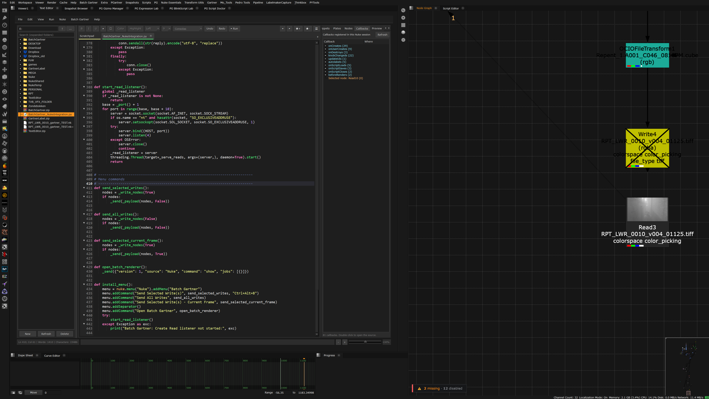

# Text Editor for Nuke

A text editor that lives inside Nuke: shot notes, task lists, Python scripts and config files, plus tools that connect your notes to the Node Graph, the Viewer and your scripts.



---

## Highlights

### Made for Nuke
- **Run Python** from any tab (`Ctrl+Enter` runs the selection or current line, `Ctrl+Shift+Enter` the whole file). Output and tracebacks appear in the Output panel; click a traceback line to jump to it, and the failing line is marked in the gutter.
- **Clickable frames and nodes in notes**: `Ctrl+Click` on `f1043` jumps the Viewer to that frame, on `[[Grade3]]` selects the node. File paths and URLs are clickable too; image paths offer *Create Read Node*.
- **Node notes**: attach a note to any node. It is stored inside the node (so it travels with the script and with copy / paste), and nodes with notes show a small `✎ note` marker. *Follow Selected Node's Note* shows the note of whatever node you select.
- **Script notes**: one note per script, saved inside the `.nk`.
- **Shot notes**: a `<shot>_notes.tnote` file next to your script, shared by every version. It opens automatically when the script loads (optional).
- **Edit knobs in the editor**: Python buttons, Text node messages and expressions open in a tab; `Ctrl+S` writes them back to the node (undoable in Nuke).
- **Capture the Viewer into a note**: renders the current frame into your rich note, captioned with the frame number.
- **Node-setup library (Recipes)**: save selected nodes as named recipes and paste them back with a double-click. Add a team folder to share a studio toolkit.
- **Script diff**: compare `v012` with `v013` and see exactly which nodes were added, removed or changed, knob by knob (node positions ignored).
- **Script outline**: every node in a `.nk`, plus all Read / Write paths with missing files flagged in red.
- **Expression tester**: Nuke expressions evaluated live as you type; TCL and Python on Enter.
- **Time per script**: tracks active time per script (only while Nuke is in front and you are working) with a weekly summary you can copy as CSV.
- **Dockable panel**: *Pane > Text Editor* docks it into Nuke's layout; it also runs as a floating window.
- **Script health check**: one click lists missing Read files, Write nodes without a path, disabled nodes left in the tree, nodes with errors, very large filter sizes and nodes whose output goes nowhere. Click a problem to select the node.
- **Node search**: find nodes by name, class or knob value across the whole script, groups included.
- **Edit a Group as text**: open the nodes inside a Group as `.nk` text, edit, and save to rebuild it (undoable; connections into the Group are kept).
- **Callback viewer**: every `onCreate` / `knobChanged` / render callback registered in the session, with the file and line it comes from, so you can find the tool that slows Nuke down.
- **StickyNote / Backdrop labels**: send text to a new StickyNote or to the selected Backdrop's label, or pull a label into your note.

### Shot checks
- **Newer plates**: when a script loads, every Read is compared with what is on disk (`/plates/sh010/v003/...` or `plate_v003.####.exr`). Reads that have a newer version are listed in the *Plates* panel; tick them and click *Update Ticked*. The update goes into the shot notes (`v012 · 2026-09-30 · pedro - plates: Read1 v003 → v005`).
- **Pre-render check**: before a Write is sent to Batch Gartner (and, if you like, before rendering in Nuke) it is checked for:
  - an output version that does not match the script version, or a file type that does not match the extension;
  - an output folder that does not exist, or frames that would be overwritten;
  - proxy mode;
  - a frame range longer or shorter than the plates;
  - a colorspace that differs from the plate (or from your studio default);
  - missing plates, disabled nodes or nodes with errors in the tree;
  - open tasks in the shot notes.

  You only see a dialog when something needs a look; *Nuke > Check Writes Before Render* shows the full result any time. Studio defaults for colorspace and file type are set in *Preferences > Shot Checks*.
- **Version Up with Note** (*File > Version Up with Note...*, `Ctrl+Alt+Shift+S`): saves `v013`, changes `v012` to `v013` in Write paths, and asks what changed. The note goes into a *Version history* list in the shot notes, so the whole shot history is in one place for dailies.

### Batch Gartner
- *Batch Gartner > Send Selected Write(s)* sends through Batch Gartner's own Nuke module (saving the script and starting the app work exactly as in its menu), and adds each Write node's note to its job.
- *Open Render Log* lists Batch Gartner's logs newest first and follows the chosen one live; *Latest Render Log of Selected Write* finds the log for the selected Write directly.
- The log folder is read from Batch Gartner's settings; if it is not found you are asked once (it can be changed in Preferences).
- Sending runs the pre-render check first. To run it from Batch Gartner's own menu too, add this to its send commands:

  ```python
  import nuke_text_editor
  if not nuke_text_editor.check_writes(nodes):
      return
  ```

### Python
- **Console** under the Output panel (`Ctrl+\``): values are printed like the Python prompt, with history on Up / Down.
- **Hover help**: hover over `nuke.createNode` (or any module function) to see its signature and documentation.
- **Problem checker**: undefined names, unused imports and syntax errors are marked in the gutter as you type; hover the mark for details (`F7` lists them).

### Notes and tasks
- **Rich notes (`.tnote`)** with bold, italic, underline, colors, highlight, fonts, alignment and pasted images. Other file types are plain text, so nothing is lost silently.
- **Task checkboxes**: `- [ ] task` lines; click the box to tick it. The status bar shows `Tasks 3/7`, and Enter continues the list.
- **People and due dates in tasks**: `- [ ] fix edges @anna due:friday`. Dates can be `today`, `tomorrow`, a weekday, `2026-10-02` or `02/10`. Overdue dates turn red; the TODO panel filters by `@person`, overdue or due this week.
- **End-of-day report**: time per script, tasks ticked off and files worked on today, as a note you can save or export.
- **Draw on Viewer captures**: arrows, circles, boxes and freehand marks before the capture goes into the note.
- **Shared-note warning**: while you have unsaved changes in a note on a network drive, a small hidden marker file tells other artists who is editing it; they get a warning when they open or save it.
- **Markdown preview** (`Ctrl+Shift+M`) next to `.md` files.
- **TODO collector**: every unchecked task and `TODO:` / `FIXME:` across a notes folder, grouped by file.
- **Templates** with shot tokens (`{shot}`, `{version}`, `{frame}`, `{date}`...): Daily Notes, Shot Checklist, Client Feedback and Shot Notes are included, and you can add your own.
- **Find in files** across a whole folder (in the background, so Nuke stays responsive).
- **Export** any note to HTML or PDF.
- **Scratchpad**: an always-there tab that saves itself.

### Editing
- Syntax highlighting for Python (including multi-line strings), `.nk` / `.gizmo`, JSON, Markdown, HTML/XML, CSS, JavaScript, C/C++/Java, Bash, Batch, INI, logs and diffs.
- Autocomplete (`Ctrl+Space`, automatic after `nuke.` in Python), snippets (type a trigger and press Tab), and a snippet library with a shared team folder.
- Line numbers, indent folding, indent guides, bookmarks, bracket matching, repeated-word highlight.
- Go to line, toggle comment, duplicate / move / delete lines, multi-cursor typing (`Alt+Click`).
- Python syntax check on save.
- Find / replace with case, whole word and regex (with `\1` / `$1` groups).
- **Command palette** (`Ctrl+Shift+P`) to run any editor action or any Nuke menu command.
- **Split view** (`Ctrl+\\`): two files side by side; right-click a tab > *Move to Other Side*.
- **Themes**: Dark, Nuke (matches Nuke's greys and orange) and Light, in Preferences.
- **Your own shortcuts**: Preferences > Shortcuts.
- **Workspaces**: save the open tabs of a show or shot under a name and reopen them later (*File > Open Workspace*).
- **Log viewer**: *Open Log (Follow)* shows a log live, with errors and warnings highlighted.

### Safety
- Files are saved via a temporary file and rename, so a crash can never leave a half-written file. Encoding and line endings are preserved.
- **Crash recovery**: unsaved work is snapshotted a few seconds after you stop typing and offered back if Nuke crashes.
- **Local history**: every save keeps the previous version; browse, compare and restore from *File > Local History*.
- Files changed outside the editor are reloaded (or you are asked, if you have unsaved changes).
- Your open tabs come back the next time you open the editor.
- Autosave straight to your files is optional (*View > Autosave to File*).

---

## Installation

1. Copy the `nuke_text_editor` folder and `menu.py` into your `.nuke` folder (for example `~/.nuke/`).
   If you already have a `menu.py`, add these two lines to it instead:

   ```python
   import nuke_text_editor
   nuke_text_editor.install()
   ```

2. Restart Nuke.

You will find:
- **PGartner > Text Editor** in the main menu (plus *Text Editor Tools*),
- **Pane > Text Editor** to dock it,
- **Text Editor** commands in the Node Graph right-click menu (node notes, edit knob, save recipe, capture viewer).

Upgrading from version 1: remove the old `TextEditor.py` and `FileBrowser.py` from `.nuke`, or keep the new `TextEditor.py` from this repository so menus that call `TextEditor.show_texteditor()` still work.

---

## Supported Platforms

- Nuke 13 and newer (Python 3.7+)
- PySide2 (Nuke 13-15) and PySide6 (Nuke 16+)
- Windows, macOS and Linux

---

## Keyboard Shortcuts

The full list is in *Help > Keyboard Shortcuts*. The main ones:

| Shortcut | Action |
| --- | --- |
| Ctrl+N / Ctrl+O / Ctrl+S / Ctrl+Shift+S | New tab / Open / Save / Save as |
| Ctrl+W, Ctrl+Tab | Close tab, next tab |
| Ctrl+Shift+P | Command palette |
| Ctrl+Enter / Ctrl+Shift+Enter | Run selection or line / run file |
| Ctrl+F, Ctrl+H, F3 | Find, replace, find next |
| Ctrl+Shift+F | Find in files |
| Ctrl+G | Go to line |
| Ctrl+/ | Toggle comment |
| Ctrl+D, Ctrl+Shift+K, Alt+Up/Down | Duplicate, delete, move lines |
| Ctrl+Space | Autocomplete |
| Tab | Indent, or expand a snippet |
| Ctrl+Shift+T | Insert task |
| Ctrl+B / I / U | Bold / italic / underline (rich notes) |
| Ctrl+F2, F2 | Toggle bookmark, next bookmark |
| Ctrl+Shift+E, Ctrl+J | Side panel, output panel |
| Ctrl+Click | Follow a link (frame, node, path, URL) |
| Alt+Click | Add a cursor (Esc clears) |
| Ctrl+Wheel, Ctrl+= / Ctrl+- / Ctrl+0 | Zoom |
| Ctrl+\\, Ctrl+Shift+\\ | Split view, move tab to other side |
| Ctrl+Shift+N | Node search |
| Ctrl+Shift+M | Markdown preview |
| F7 | Check Python for problems |
| Ctrl+\` | Python console |
| Ctrl+Alt+Shift+S | Version Up with Note (Nuke's File menu) |

While the editor has focus its shortcuts take priority over Nuke's. All of them can be changed in *File > Preferences > Shortcuts*.

---

## Where Data Is Stored

- Preferences: Qt `QSettings` under `PGartner / NukeTextEditor` (*File > Preferences*).
- Everything else lives in `~/.nuke/text_editor/`: bookmarks, crash recovery, local history, templates, recipes, snippets, captured images, the scratchpad and the time log. Nothing is written next to your files except shot notes and the images of a rich note (`<note>_files/`).
- Node notes and script notes are stored inside the Nuke script.
- Diagnostics: `~/.nuke/text_editor/logs/` (`startup.log`, `crash.log`, `errors.log`) - send these if something goes wrong. On Windows `crash.log` covers opening the editor; set the environment variable `NUKE_TEXT_EDITOR_CRASH_LOG=all` to cover the whole session.

---

## Customization

- **Templates**: *File > New from Template > Open Templates Folder*, then add `.txt` or `.tnote` files. Tokens: `{script} {script_path} {shot} {version} {frame} {first_frame} {last_frame} {format} {user} {date} {time}`.
- **Snippets**: *View > Snippets* (New / Edit). A team `snippets.json` can be shared through a folder set in Preferences.
- **Recipes**: a team recipes folder can be set in Preferences.
- In the code: `DEFAULT_FONT_SIZE`, `PREFERRED_MONOSPACE_FONTS`, colors in `highlighter.py`, file types in `fileio.EXTENSION_LANGUAGE`.

---

## Development

```
pip install pytest pytest-qt PySide6
QT_QPA_PLATFORM=offscreen pytest tests
```

The logic modules (`fileio`, `links`, `textops`, `nkparse`, `templates`, `history`, `timelog`, `snippets`, `scripttools`, `shotcheck`, `lint`, `dailylog`, `locks`, `bgartner`, `nuke_bridge`) do not need Qt or Nuke and are fully covered by tests. All Nuke API calls go through `nuke_bridge.py`, so the editor also runs outside Nuke.

---

## Known Limitations

- File browser search only looks inside folders that have been expanded at least once.
- Folding is indent-based and is not remembered after a file is closed.
- Zoom scales text that uses the default size; text given an explicit size in a rich note keeps that size.
- Viewer capture renders the Viewer's input, without the Viewer's display LUT or overlays.
- Text edits to the `.nk` of the open script apply only after the script is reopened in Nuke.
- On some Linux desktops `Alt+Click` is taken by the window manager; use the menu or change that setting.
- The problem checker is intentionally simple: a name defined anywhere in the file counts as defined.
- Batch Gartner does not show job notes yet; they are included in the job data it receives.
- The plate check understands version numbers written as `v003` in folder or file names. Paths built with expressions (`[value ...]`) are not checked, and those Reads are not updated automatically.
- After a plate update, the Read's frame range stays as it was; check it if the new plate is longer or shorter.

---

## License

See **LICENSE** for details.

---

## Authors & Contact

Created by **Pedro Gartner**
LinkedIn: https://www.linkedin.com/in/pedro-g-6b265a13a/
IMDB: https://www.imdb.com/name/nm9884333/
GitHub: https://github.com/PedroGartner
